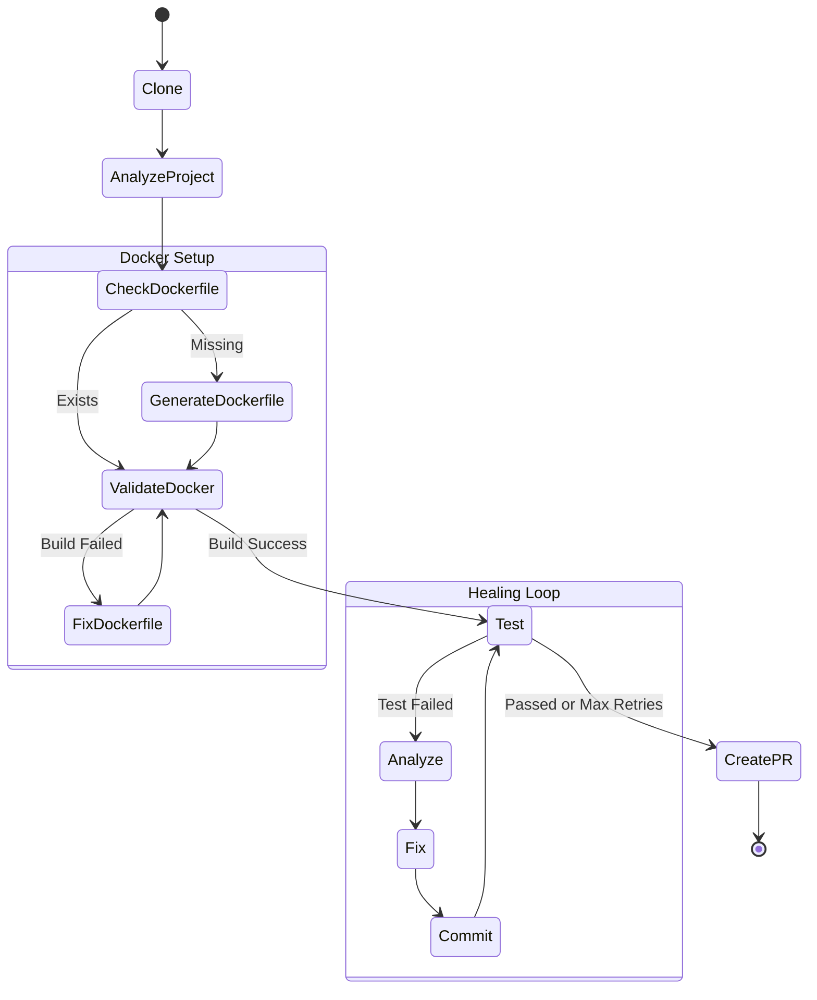

# System Architecture

## Overview

The "Next-ps" project is an Autonomous AI Agent designed for CI/CD healing. It automatically pulls code from GitHub, detects build/test errors, and generates fixes using LLMs.

The system is composed of three main layers:

1.  **Frontend**: A Next.js application that provides a dashboard for users to monitor the agent's progress.
2.  **Backend API**: A FastAPI service that manages authentication, session state, and triggers the autonomous agent.
3.  **LangGraph Agent**: A stateful workflow engine that orchestrates the "Healing Loop" (Clone -> Test -> Analyze -> Fix -> Commit).

## High-Level Architecture

```mermaid
graph TD
    User[User / Developer] -->|Interacts| Frontend[Frontend "Next.js Dashboard"]
    Frontend -->|HTTP Requests| Backend[Backend "FastAPI Server"]

    subgraph "Backend Infrastructure"
        Backend -->|Triggers| Coordinator[LangGraph Coordinator]
        Backend -->|Updates| SessionState[In-Memory Session State]
    end

    subgraph "Autonomous Agent Workflow (LangGraph)"
        Coordinator -->|1. Setup| Clone[Clone Node]
        Clone -->|2. Docker| DockerGen[Generate/Validate Dockerfile]
        DockerGen -->|3. Execution| TestRunner[Test Runner Node]
        TestRunner -->|4. Failure?| Analyzer[Bug Analyzer Agent]
        Analyzer -->|5. Fix| FixGen[Fix Generator Agent]
        FixGen -->|6. Commit| Git[Git Commit/Push Node]
        Git -->|Loop| TestRunner
        TestRunner -->|Success| PR[Create Pull Request]
    end

    subgraph "External Services"
        Clone <-->|Git Ops| GitHub[GitHub API]
        PR -->|Create PR| GitHub
        Analyzer <-->|Inference| LLM[LLM Provider "HuggingFace/OpenAI"]
        FixGen <-->|Inference| LLM
        DockerGen -->|Builds| DockerDaemon[Docker Daemon]
    end
```

## LangGraph Workflow Detail

The core logic resides in `backend/langgraph_flow.py`. It uses a directed cyclic graph to iteratively fix bugs.



## Component Description

### 1. Backend (`backend/`)

- **`main.py`**: Entry point. Exposes REST endpoints (`/start-autonomous-run`, `/status`) and streams LangGraph events to update the dashboard.
- **`langgraph_flow.py`**: Defines the `StateGraph` and node logic. This is the "brain" of the operation.
- **`docker_manager.py`**: Handles Docker container lifecycles for safe test execution.

### 2. Agents (`backend/agents/`)

- **`BugAnalyzerAgent`**: Parses error logs to identify file, line, and error type.
- **`FixGeneratorAgent`**: Uses LLMs to generate code fixes based on the analysis.
- **`TestRunnerAgent`**: Orchestrates the execution of `npm test` or `pytest` inside the Docker sandbox.

### 3. Frontend (`frontend/`)

- **Dashboard**: Real-time visualization of the agent's logs, current step, and success rate.
